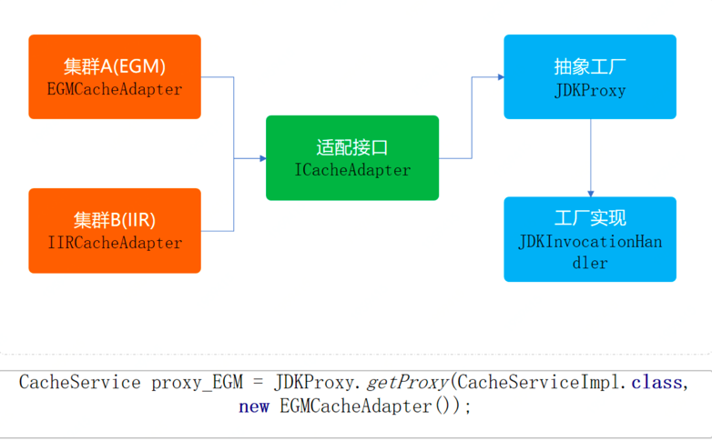
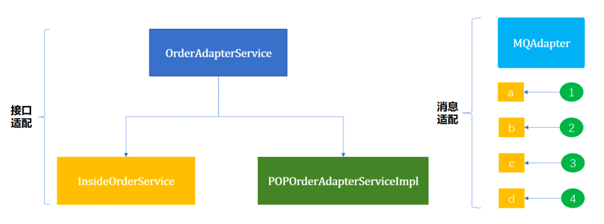

# 抽象工厂

ICacheAdapter ，定义了适配接⼝，分别包装两个集群中差异化的接⼝名
称。 EGMCacheAdapter 、 IIRCacheAdapter

JDKProxy 、 JDKInvocationHandler ，是代理类的定义和实现，这部分也就是抽象⼯⼚的
另外⼀种实现⽅式。通过这样的⽅式可以很好的把原有操作Redis的⽅法进⾏代理操作，通过
控制不同的⼊参对象，控制缓存的使⽤。

# 建造者模型结构

Builder ，建造者类具体的各种组装由此类实现。

DecorationPackageMenu ，是 IMenu 接⼝的实现类，主要是承载建造过程中的填充器。相当于
这是⼀套承载物料和创建者中间衔接的内容。
# 适配器模型结构

