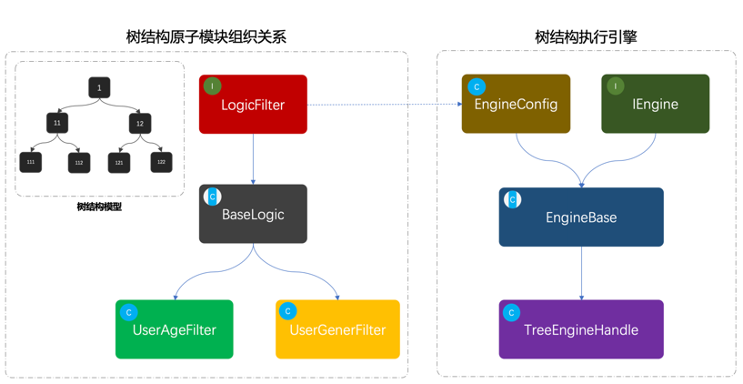

# 模型结构

## 抽象工厂

ICacheAdapter ，定义了适配接⼝，分别包装两个集群中差异化的接⼝名称。 EGMCacheAdapter 、 IIRCacheAdapter

JDKProxy 、 JDKInvocationHandler ，是代理类的定义和实现，这部分也就是抽象⼯⼚的另外⼀种实现⽅式。通过这样的⽅式可以很好的把原有操作Redis的⽅法进⾏代理操作，通过控制不同的⼊参对象，控制缓存的使⽤。

## 适配器

## 桥接模式

## 组合模式

## 装饰器模式

## ⻔⾯模式

## 享元模式

## 代理模式中间件

## 责任链模式

## 命令模式

## 迭代器模式

## 中介者模式

##备忘录模式

##观察者模式

##状态模式

##策略模式

